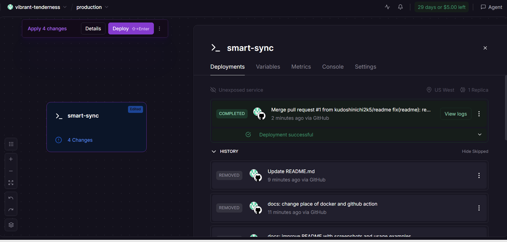
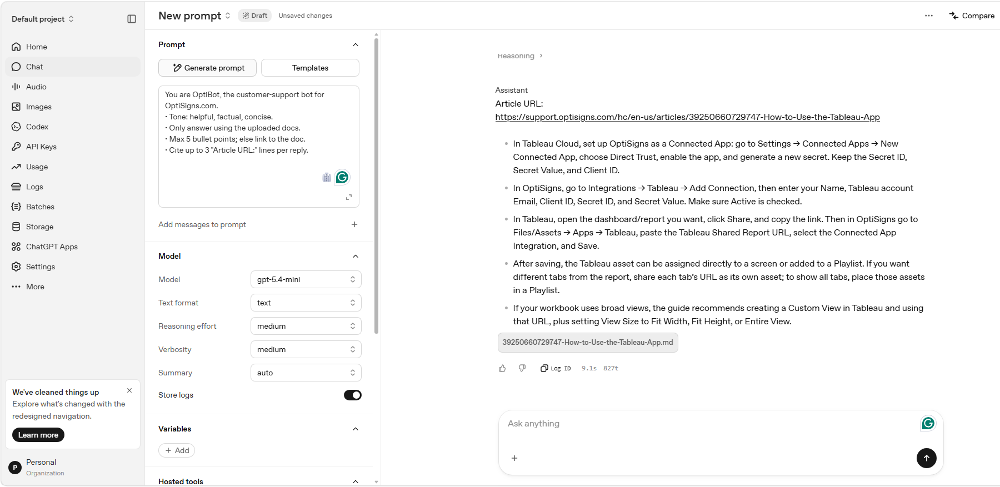
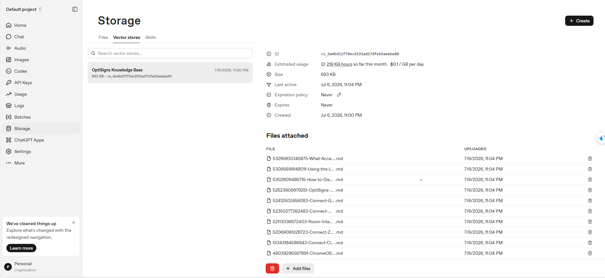
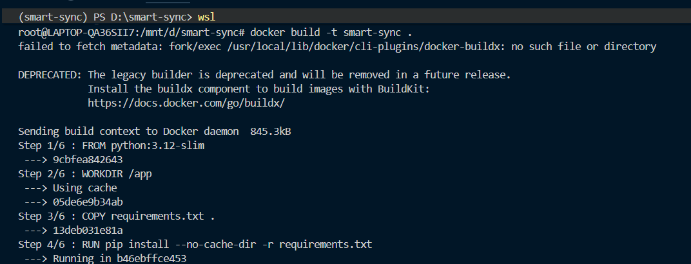
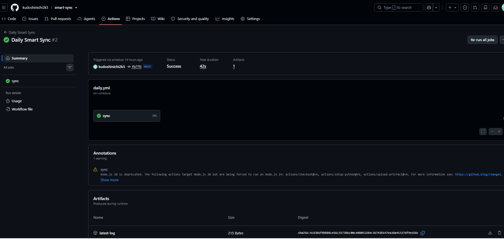

# Smart Sync

A lightweight knowledge synchronization pipeline for ingesting support documentation into an OpenAI Vector Store.

The project automatically scrapes OptiSigns Help Center articles, converts them into clean Markdown, uploads them into an OpenAI Vector Store, and keeps the knowledge base synchronized through scheduled automation.

---

# Features

- Scrape support articles directly from the OptiSigns Zendesk API
- Convert HTML articles into clean Markdown
- Preserve:
  - headings
  - code blocks
  - hyperlinks
- Remove unnecessary HTML and navigation content
- Detect newly added articles
- Detect updated articles using SHA256 hashing
- Upload only changed documents
- Store documents inside an OpenAI Vector Store
- Automatically synchronize documentation
- Generate execution logs
- Dockerized for one-command execution
- Cloud deployment using Railway
- Automated daily synchronization using GitHub Actions

---

# Project Architecture

```
OptiSigns Help Center
        │
        ▼
 Fetch Articles
        │
        ▼
Convert HTML → Markdown
        │
        ▼
 Save Markdown Files
        │
        ▼
 SHA256 Comparison
        │
        ▼
 Added / Updated ?
        │
        ▼
 Upload Delta Files
        │
        ▼
 OpenAI Vector Store
        │
        ▼
 OpenAI Assistant
```

Only newly added or modified documents are uploaded, reducing unnecessary API calls and embedding costs.

---

# Project Structure

```
smart-sync/
│
├── docs/
│       Markdown articles
│
├── logs/
│       latest.log
│       state.json
│
├── screenshots/
│       assistant_answer.png
│       openai_vector_store.png
│       docker_run.png
│       github_action_success.png
│       cloud_deployment.png
│
├── scraper/
│       fetch_articles.py
│       hash_utils.py
│
├── uploader/
│       upload_vector_store.py
│
├── .github/
│   └── workflows/
│           daily.yml
│
├── Dockerfile
├── requirements.txt
├── config.py
├── main.py
└── README.md
```

---

# Technology Stack

- Python
- OpenAI API
- OpenAI Vector Store
- Requests
- Markdownify
- Docker
- Railway
- GitHub Actions

---

# Environment Variables

Create a `.env` file.

```env
OPENAI_API_KEY=your_openai_api_key
VECTOR_STORE_ID=your_vector_store_id
```

Example

```env
OPENAI_API_KEY=sk-xxxxxxxxxxxxxxxxxxxxxxxx
VECTOR_STORE_ID=vs_xxxxxxxxxxxxxxxxxxxxx
```

---

# Installation

Clone the repository.

```bash
git clone https://github.com/kudoshinichi2k5/smart-sync.git

cd smart-sync
```

Install dependencies.

```bash
pip install -r requirements.txt
```

---

# Running Locally

Run the synchronization pipeline.

```bash
python main.py
```

Example output

```text
============================================================
STEP 1 - SCRAPING
============================================================

Found 35 articles

============================================================
STEP 2 - DELTA DETECTION
============================================================

Added   : 0
Updated : 1
Skipped : 34

============================================================
STEP 3 - REMOVE OLD FILES
============================================================

============================================================
STEP 4 - UPLOAD
============================================================

Upload completed.

Done.
```

---

# Docker

Build the Docker image.

```bash
docker build -t smart-sync .
```

Run the container.

```bash
docker run \
-e OPENAI_API_KEY=YOUR_API_KEY \
-e VECTOR_STORE_ID=YOUR_VECTOR_STORE_ID \
smart-sync
```

The container performs one synchronization and exits successfully.

---

# Cloud Deployment

The project is successfully deployed on **Railway**.

Railway automatically builds the Docker image from the GitHub repository and deploys the application. Environment variables are configured through Railway's project settings.

Deployment configuration:

- Source: GitHub Repository
- Runtime: Docker
- Platform: Railway
- Environment Variables:
  - OPENAI_API_KEY
  - VECTOR_STORE_ID

The deployment completed successfully.



---

# Daily Synchronization

The project uses **GitHub Actions** to perform automatic synchronization.

Workflow file

```text
.github/workflows/daily.yml
```

The workflow performs:

1. Checkout repository
2. Install Python dependencies
3. Execute Smart Sync
4. Detect new or updated articles
5. Upload only changed documents
6. Save synchronization state
7. Upload execution log as an artifact

---

# Chunking Strategy

This project uses the default OpenAI Vector Store chunking strategy.

The default chunking strategy provides a good balance between retrieval quality and implementation simplicity while preserving semantic context for Retrieval-Augmented Generation (RAG).

---

# OpenAI Assistant

System Prompt

```text
You are OptiBot, the customer-support bot for OptiSigns.com.

• Tone: helpful, factual, concise.
• Only answer using the uploaded docs.
• Max 5 bullet points; else link to the doc.
• Cite up to 3 "Article URL:" lines per reply.
```

---

# Screenshots

## Assistant Answer

The assistant answers user questions using the uploaded knowledge base and provides citations from the corresponding documentation.



---

## OpenAI Vector Store

All Markdown documents are successfully uploaded into the OpenAI Vector Store.



---

## Docker Execution

The Docker container successfully executes one synchronization task.



---

## Cloud Deployment

The application is successfully deployed on Railway.


---

## GitHub Actions Workflow

The scheduled synchronization workflow executes successfully on GitHub Actions.



---

# Execution Logs

Example

```text
Run Time : 2026-07-05 22:05:31

Added    : 0

Updated  : 1

Skipped  : 34

Uploaded : 1
```

Logs are generated at

```text
logs/latest.log
```

The synchronization state is stored in

```text
logs/state.json
```

---

# Repository Notes

- No API keys are hard-coded.
- Configuration is provided through environment variables.
- Only changed articles are uploaded.
- Existing Vector Store is reused across executions.
- Synchronization state is persisted between runs.
- Successfully deployed on Railway.
- Docker and GitHub Actions are both supported.

---

# Future Improvements

Possible enhancements include:

- Parallel article downloading
- Automatic deletion of removed articles
- Retry mechanism for API failures
- Custom chunking strategy
- Support for multiple knowledge bases
- Monitoring and alerting
- Unit and integration tests

---

# Author

**Le Trung Kien**

University of Information Technology (UIT)

Computer Networks and Communications